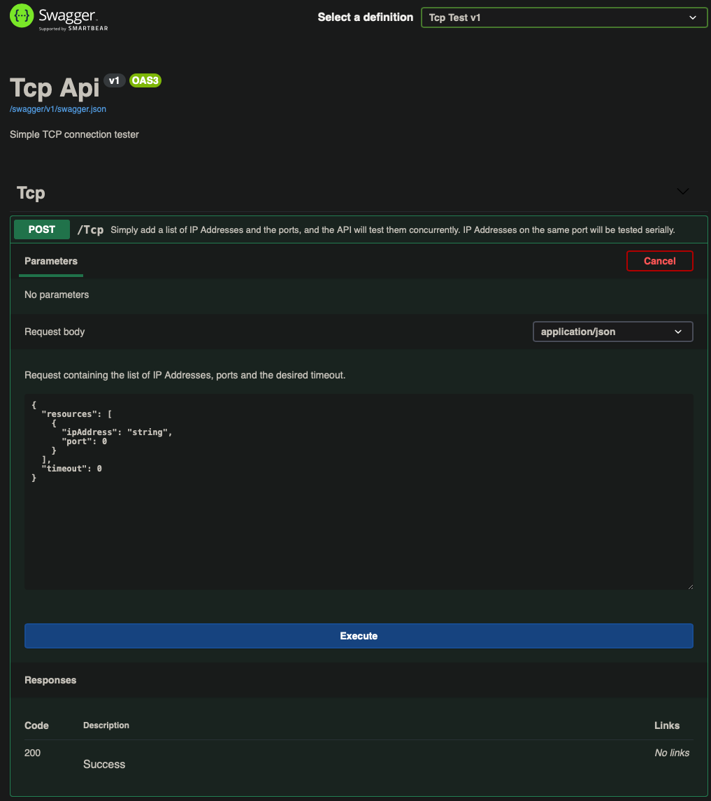

# Tcp Test

A simple app that tests connectivity from a pod to the IPs and ports supplied in the request.  Useful for testing network boundaries.

## Usage

### Deployment

```
apiVersion: apps/v1
kind: Deployment
metadata:
  name: tcp-test-deployment
  namespace: default
  labels:
    app: tcp-test-app
spec:
  replicas: 1
  selector:
    matchLabels:
      app: tcp-test-app
  template:
    metadata:
      namespace: default
      labels:
        app: tcp-test-app
    spec:
      containers:
        - name: tcp-test
          image: docker.pkg.github.com/observian/tcptest/tcp-tester:latest
          env:
            - name: PORT
              value: "8080"
            - name: HOST_NAME
              valueFrom:
                fieldRef:
                  fieldPath: spec.nodeName
            - name: POD_IP
              valueFrom:
                fieldRef:
                  fieldPath: status.podIP
            - name: HOST_IP
              valueFrom:
                fieldRef:
                  fieldPath: status.hostIP
---
kind: Service
apiVersion: v1
metadata:
  name: tcp-test-service
  namespace: default
spec:
  type: LoadBalancer
  selector:
    app: tcp-test-app
  ports:
    - name: http
      protocol: TCP
      port: 80
      targetPort: 8080
    - name: https
      protocol: TCP
      port: 443
      targetPort: 8080
```
You can deploy this to your cluster with the yaml above.  The port is configurable via the env variable if you need to adjust it; just be sure you also adjust the target ports on the service if you do.

### Testing connectivity

Once it's deployed and stable, you should be able to hit the IP address and you'll get a swagger page.



From here, you can simply add an IP address and port, and click execute.  You can add as many resource objects as you want.  Keep in mind that tests to distinct IP addresses on the same port have to be tested serially.  If the timeout is left at 0, the default will be 1 second.  You can increase the timeout tolerance (in one-second increments) if needed.

Feel free to suggest features or improvements